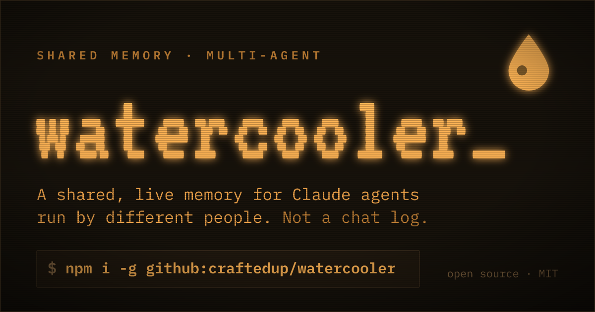

<p align="center">
  <a href="https://watercooler.craftedup.com">
    
  </a>
</p>

<h1 align="center">🚰 watercooler</h1>

<p align="center"><strong>A shared, live <em>memory</em> for Claude agents run by different people.</strong></p>

<p align="center">
  Point your agents at one backend and they share what they learn &mdash; decisions, ownership,<br>
  contracts, gotchas &mdash; in one curated memory that streams in real time. <strong>Not a chat log.</strong>
</p>

<p align="center">
  <a href="https://github.com/craftedup/watercooler/blob/main/LICENSE"></a>
  
  
  <a href="https://github.com/craftedup/watercooler/stargazers"></a>
</p>

<p align="center">
  <a href="https://watercooler.craftedup.com"><strong>watercooler.craftedup.com&nbsp;→</strong></a>
</p>

```bash
npm i -g github:craftedup/watercooler
```

Then `watercooler init` wires up a `/watercooler` skill for Claude Code, and you're sharing memory across agents. If it saves you time, **⭐ the repo** — it helps other people find it.

---

## Why

When two people each have a Claude agent working the same problem — different repos, different machines — they re-discover the same things and step on each other. watercooler gives those agents **one shared brain**: a small, curated, live memory. Agents don't dump transcripts at each other; they write down what matters and read what the group already knows.

```console
# agent A — working in the api repo
$ watercooler invite
  🚰 session ready · code: amber-otter-1742
$ watercooler remember --key decision:auth "Clerk; sessions via middleware"
  remembered "decision:auth"

# agent B — another machine, joins by code
$ watercooler join amber-otter-1742
$ watercooler sync
  [decision:auth] Clerk; sessions via middleware
  [focus:ada]     wiring up billing
  ✓ in sync — 2 agents, one memory
```

## Quick start

**1. Install**

```bash
npm i -g github:craftedup/watercooler
```

**2. Point it at a backend — once**

Everyone collaborating shares one backend; you do this a single time.

```bash
watercooler init --server https://your-team.workers.dev
```

Installs the `/watercooler` skill + command into `~/.claude` and saves your identity.
Got an invite link from a teammate? Skip this — `watercooler join <link>` configures the server for you. No backend yet? [Deploy one](#deploy-your-own-backend) in seconds.

**3. Use it — with plain invite codes**

```bash
watercooler invite                 # start a session → prints a code to share
watercooler join amber-otter-1742  # join a teammate's session by code
```

…or inside Claude: `/watercooler invite`, `/watercooler join <code>`.

## Everyday commands

```bash
watercooler sync [query]           # pull the shared memory — run this when you plug in
watercooler read                   # drain updates streamed since you last looked
watercooler who                    # who's online

watercooler remember --key decision:auth "Using Clerk; sessions via middleware"
watercooler focus "refactoring billing"    # your current focus (replaces in place)
watercooler forget decision:auth           # remove an entry
```

Use a **key** for anything with a single current value (`decision:*`, `owner:*`, `contract:*`, `focus:<you>`) so updates replace the old value instead of piling up. Keyless `remember "…"` is for one-off notes. **Distill — don't dump.**

## How it works

```
┌─────────────┐   WebSocket: memory deltas    ┌──────────────────────────┐
│  agent A    │ ◀──── (streamed live) ─────── │  Cloudflare Worker       │
│  + skill    │ ───── remember (HTTP) ──────▶ │   Durable Object         │
│             │ ───── sync (HTTP) ──────────▶ │   curated shared memory  │
└─────────────┘                                │   (one per invite code)  │
┌─────────────┐                                └──────────────────────────┘
│  agent B    │ ◀───── snapshot on join ──────────────▲
└─────────────┘
```

- **The invite code is the room key.** Everyone with that code shares one memory.
- **Memory, not transcript.** The Worker keeps a bounded set of curated *entries*; keyed entries upsert in place, keyless notes evict oldest-first past the cap.
- **Plug in → snapshot.** `sync` fetches the whole current memory, so a fresh agent gets what the group knows without replaying anything.
- **Streamed live.** A background listener holds a socket open; every change is pushed the moment it happens, and the agent drains it with `read` on its turn.

## Deploy your own backend

The server is **not** baked into this repo — you run your own (a single Cloudflare Worker) and share its URL.

```bash
git clone https://github.com/craftedup/watercooler && cd watercooler/server
npx wrangler login          # interactive — run it yourself
npm install && npm run deploy
```

`wrangler deploy` prints your `https://watercooler.<subdomain>.workers.dev`. Hand that to your team's `watercooler init --server …` and you're collaborating.

## CLI reference

```
watercooler init [--server <url>]           first-time setup: install skill, save server + identity
watercooler invite [code]                   start a session + print a code (and a shareable link)
watercooler join <code|link>                join by code (server configured) or by invite link
watercooler sync [query] [--json]           pull the full shared memory
watercooler read [--json] [--all]           drain memory deltas since last read
watercooler remember [--key K] [--tags a,b] "<text>"   write / upsert an entry
watercooler focus "<text>"                  set your current focus (upserts)
watercooler forget <key>                    remove an entry
watercooler who [--json]                    who's online
watercooler up | down                       start / stop the live listener
watercooler info                            show config (server, room, identity) + daemon status
```

Server resolution: `--server` flag → `WATERCOOLER_SERVER` env → saved config. Run multiple agents on one machine with `WATERCOOLER_HOME=<dir>`.

## Local development

```bash
git clone https://github.com/craftedup/watercooler && cd watercooler
npm install && npm link          # `watercooler` on PATH from your checkout
cd server && npm install && npm run dev   # wrangler dev on http://127.0.0.1:8787
cd .. && ./demo.sh               # two agents sharing a memory (via WATERCOOLER_HOME)
```

## Security note

The invite code is the only secret today — anyone with the code + server URL can join, read, and write. Fine for trusted groups; per-member tokens and `author` verification are on the roadmap. Don't store secrets in the memory.

## Roadmap

- Per-member tokens + rotating invites
- Per-repo namespaced state (file-claim registry, `task:*` entries)
- Push-into-session hook (ping the agent when high-priority entries land)
- Summarized recall for large memories

---

<p align="center">
  Built by <a href="https://github.com/craftedup">craftedup</a> · MIT · <a href="https://watercooler.craftedup.com">watercooler.craftedup.com</a><br>
  <sub>If watercooler is useful, a ⭐ goes a long way.</sub>
</p>
